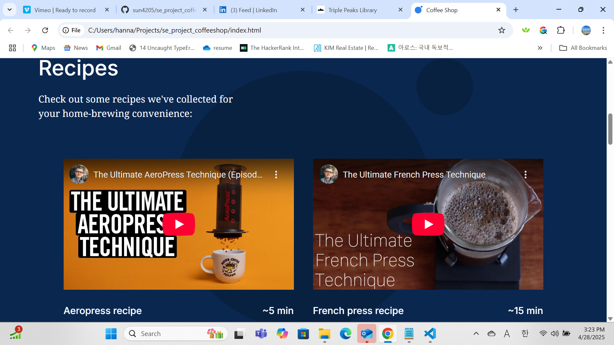
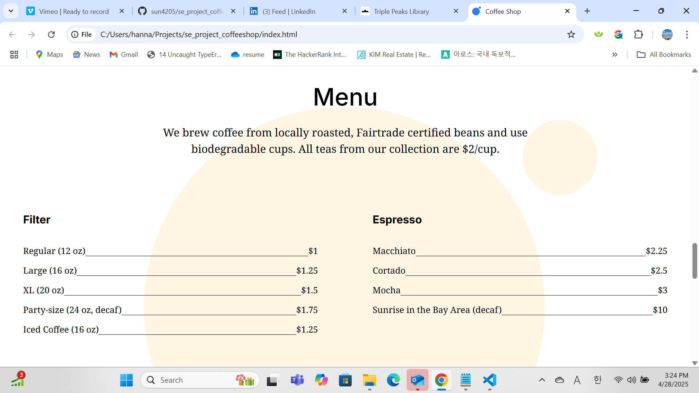
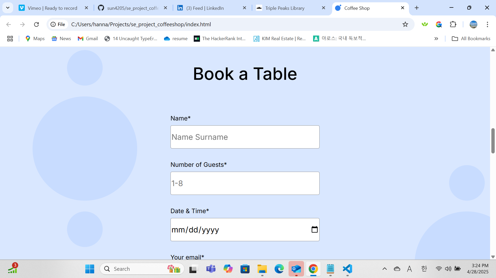

# Triple Peaks Coffee Shop

This is the second project of the Software Engineering program at TripleTen. It was created using HTML and CSS, based on the design brief.

## Project features

- Semantic HTML5
- Flexbox
- Positioning
- Flat BEM file structure
- A custom form
- CSS animation and transform

## Plan on improving the project

I plan to add more interactive features and creative designs to capture the user's attention.

## Screenshot
Reciepes page Screenshot

Menu page Screenshot

Book a table Screenshot

